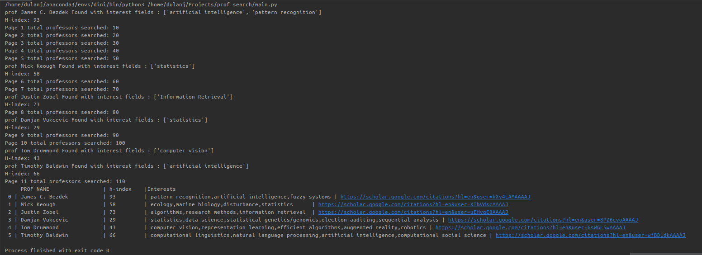
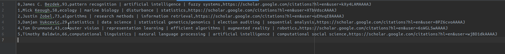

# This code will search for professors in [Google-scholar](https://scholar.google.com/citations?view_op=search_authors&hl=en&mauthors=) given a basic search query link

## Install the requirements

```angular2html
pip install -r requirements.txt
```
## Change the config file as your wish

```json

{
  "search_page_depth": {No of pages needs to search | int},
  "starting_url": {starting url | string} ,
  "my_interests": [
    {List of interests | String}
  ],
  "save_filename": {Text file name | string}
}
```

Go to the [google scholar profiles page](https://scholar.google.com/citations?view_op=search_authors&hl=en&mauthors=) to get the starting url...

## Run the main.py file

```angular2html
python3 main.py
```

You will see the following



Then after the end of the search, the data will be dumped to a text file like below



## Apply for your PHD today! 